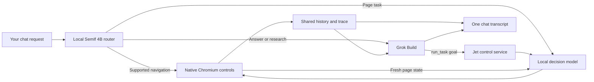

# Jet Browser

New here? Read the [agent handoff](docs/HANDOFF.md), [architecture](docs/architecture.md),
[development guide](docs/development.md), and [AGENTS.md](AGENTS.md).

Custom JavaScript workflows and self-contained setup: [usage and verification](docs/portable-workflows.md). Website collections: [usage and limits](docs/collections.md).

A standalone macOS Chromium browser with **one local-first agent chat**. A local SemIf/Qwen 4B router decides whether it can handle your request with browser controls or should bring in Grok Build CLI for conversation and research. Grok can delegate page tasks to the smaller local models. Both paths share conversation history and show their actions in the same transcript.

The app uses its own locally vendored `shadcn_flutter`, `vten_chat`, and CEF packages. The chat pane renders vten's transcript column, user cards, assistant Markdown, compact tool rows, dot-matrix activity, and composer. Diagnostics open from the header. It does not require the vten IDE to be running or share its browser profile.

## Open it

Open **[dist/Jet Browser.app](dist/Jet%20Browser.app)**. This Apple Silicon macOS test build bundles its controller, Python/model dependencies, Grok CLI and native JavaScriptCore helper. End users do not install Python, Node, Lua, a CLI or a source checkout. The app is about 2.5 GB, excluding model weights.

First launch shows **Models and setup**: download SemIf 4B and the 0.8B typing model, and sign in to Grok. Optional LFM and Laya models are available there too. Downloads show size/progress, support cancel/retry, and verify pinned SHA256 checksums. The setup screen opens before Chromium; macOS may request access to Chromium Safe Storage when opening the browser.

Private app data goes under `~/.jet-browser`. The development profile and saved collections in this checkout are separate and are not automatically migrated. Close an older development instance before using the default app port; the launcher refuses to connect to a different data directory's service.

This is a local ad hoc signed build, not a Developer ID signed/notarized public release. See [actual portability evidence and remaining native checks](docs/portable-workflows.md#verification).

In chat, try:

> Find me the Wikipedia page for Elon Musk.

Then: “Now find that same kind of page for Ada Lovelace”, “Go back”, or “Show my open tabs”. A simple supported request finishes locally; an answer such as “Summarize this page” goes to Grok with the actual browser state and bounded shared history.

Also try “Bring me to YouTube”, “Open NASA's YouTube channel”, or “Open a NASA playlist on YouTube”. Known-site homepage requests use direct navigation without a model call. Resource requests check the requested page kind and visible identity before reporting completion. Local identity assessments remain labelled as model assessments.

Drag the divider to resize chat, or hide it with the panel button beside the address bar. Drafts survive hiding chat and switching sessions. A new conversation offers editable examples; history can be searched by title. The existing vten Markdown and tool presentation remains in the same conversation.

On the included local practice page, try:

> On the current workshop page, enter Solstice as the team name and ash@example.test as the contact email. Choose the Afternoon session, enable Updates and open the registration preview. Use the local browser tool and check the result.

There is a single composer. Settings choose the local page-action model; the dedicated router uses SemIf 4B. **Stop** cancels the turn, including connection startup, and prevents subsequent browser actions; it lets an already dispatched action finish. Stopping ends the current Grok process, and the next turn receives the saved conversation history. History and New chat switch durable sessions without replaying browser actions. Claude Code and Codex adapters remain future integrations.

## How the handoff works



The controller sends smaller questions to the selected model, matches explicit instructions to observed labels, remembers form progress and uses the separate local Qwen3.5 0.8B helper to supply typed values. The local models do not generate browser code or selectors. No model weights were trained in this extraction.

The available local page-action engines are LFM RLCD 350M, Laya MLX 421M, Laya Typed 421M and SemIf/Qwen3.5 4B. **The packaged app defaults to SemIf 4B; development retains LFM as its page-action default.** The separate 4B router was selected after it classified the tested requests more reliably than the smaller models. These are measured examples, not a guarantee on arbitrary prompts. Grok chat is a remote provider call; routing, page decisions and typing run locally.

## Development

See [developer setup](docs/development.md) for prerequisites, isolated tests and packaging.
A fresh clone needs the matching ignored CEF assets before a native build; the setup
script does not download them.

```sh
bash scripts/setup.sh
bash scripts/start.sh --dev
uv run --project backend python -m pytest backend/tests -q
uv run --project backend ruff check backend/jet_browser backend/tests
cd app
flutter analyze
flutter test
```

Large model files and CEF assets are already copied into this local project. Model files were copied with APFS cloning, so they are independently owned without eagerly duplicating all disk blocks. The source/weight notices and revisions are retained. They are ignored by git; the current bootstrap installs environments and builds from the assets present here.

`scripts/check_live_models.py` performs real, serial local form checks and saves every outcome in `artifacts/`. It makes no Grok or hosted Jev calls. `scripts/setup_models.sh` installs independent environments for the pinned engines; it does not reuse the original project's virtualenvs.

`backend/.venv/bin/python scripts/check_chat_handoff.py` checks the full chat-to-browser path with a real Grok request through your installed login. It records streaming progress and independently checks the local form's final values.

Developer controls use the same finite API:

```sh
./jet status
./jet tabs
./jet read
./jet open https://example.com
./jet task 'Open the requested page' --model lfm_rlcd
./jet stop
./jet trace
./jet trace --follow
./jet trace --turn <turn-id>
./jet metrics
```

The commands above target the development profile on port 9148, not arbitrary packaged instances.

The main agent receives finite MCP tools including tab controls, URL navigation, page observation, local tasks and current-session history. Its temporary working directory and permission rules are separate from your global Grok configuration. Native web search/fetch and the owned browser tools use precise tool identities; file/shell tools are excluded. The native host connects privately on loopback port 9148 with an owner-only token; the typing helper uses 9149. Chromium remote debugging is disabled.

## Tracing

Every chat turn has a stable ID linked to its route, messages and local tasks. Local OpenTelemetry spans and structured JSONL events cover model load/inference, queue waits, routing choices, Grok permissions/tools, native command dispatch/acknowledgement, focus diagnostics, cancellation and failures. Trace details are available in chat and through `./jet trace`; `./jet metrics` reports counts, failures and rolling latency percentiles. See [diagnostic questions and commands](docs/tracing.md).

The journal is private and rotated, with no network telemetry exporter. It records bounded metadata, counts and finite choices; it excludes prompts, typed values, page text, credentials and hidden reasoning. Conversation content remains in the private session database because it is needed for history. Older experimental task recordings may still contain actual test values.

## Local-first audit and navigation completion

The [deep audit](docs/local-first-agent-audit.md) maps all 18 official Jev cookbooks to concrete browser workflows and records a four-model routing diagnostic. Search completion checks the intended destination and follows observed links in bounded native-model batches. [Navigation goals](docs/navigation-goals.md) extend those checks to homepages, explicit URLs and YouTube resources. See [the UI/harness audit](docs/ui-ux-audit.md) and [actual results and limits](docs/VERIFICATION.md).

Run native checks while the app is idle:

```sh
backend/.venv/bin/python scripts/check_navigation_goals.py --run
backend/.venv/bin/python scripts/check_navigation_intent.py --run
```

These checks use temporary sessions/tabs, retain timestamped failures and restore prior context only while they still own it. The eight-case goal check judges the actual page independently, stops its own Grok handoffs and never counts a route's `done` status alone as success. `--help` and import make no API calls.

Score the retained routing probes without calling a model:

```sh
backend/.venv/bin/python scripts/audit_local_routing.py --score artifacts/local-first-routing-audit.json
```

## Current limits and evidence

See [the live verification record](docs/VERIFICATION.md) for what actually ran. Initial native input failures and model failures are retained rather than counted as successes. A model's DONE output is not independent verification; custom task results include page evidence for Grok and you to inspect.

This is a packaged local test build for interactive browser tasks. The current observation loop primarily handles main-document controls; complex editors, cross-origin frames and long ambiguous workflows need more work. Developer ID signing/notarization and clean-account native browser acceptance remain open. The retry passed Keychain; a Flutter accessibility lifecycle crash was repaired and the packaged native browser now passes startup, DOM read and chat hide/restore checks. See [native rerun](docs/native-startup-accessibility.md). No encryption bypass was introduced.

The packaged browser profile, token, session database and diagnostics live in `~/.jet-browser/.runtime/`; development keeps the ignored project `.runtime/`. Closing the window preserves the profile and conversations. Restarting restores messages and task evidence, marks interrupted work stopped, and never replays it. A newly started Grok process receives bounded relevant history from the selected conversation.

- [Specification](docs/SPEC.md), [current remaining work](tasks/remaining-work.md), and [historical checklist](tasks/todo.md)
- [Native browser extraction](docs/browser-extraction.md)
- [Local Shadcn fork](docs/shadcn-fork.md)
- [Grok ACP contract](docs/grok-acp.md)
- [Copied source hashes](docs/extracted-source.json)

## Guided code review

The local review contains the initial project patch and an authored tour. The source baseline is committed on `main`; `.clankstamp/` is local-only and is not required by a fresh clone.

```sh
clankstamp open run_20260924_002021_jet-browser --step step_001
```

The original tour was captured before the first commit and retains an empty-base warning. Current handoff and verification summaries are committed in `docs/`.


### Background jobs and agent files

Ask **“Continue categorizing all my bookmarks for 30 minutes.”** Grok configures a saved local feed job; SemIf handles categorization and periodic progress decisions. The compact card offers Pause, Stop, Open and expandable details. Chat remains available for questions and document work while the job owns the browser.

Ask **“Create a document and save it in my workspace.”** The Workspace folder button opens private conversation files under `~/.jet-browser/workspaces`; static HTML artifacts can open in a sandboxed Jet tab. See [behavior, limits and verification](docs/background-jobs-and-workspace.md).

### Iterative collection reviews

Feed jobs now pause after their first ten items for a compact sample review. Grok can suggest category changes; you can add observed fields and choose periodic check-ins or continued local work until a limit. See [supervised collections](docs/supervised-collections.md) for sample-sharing, metadata and restart behavior.

Tab-bound execution and exact-post recovery are described in [tab-bound jobs](docs/tab-bound-jobs.md). Grok can now author, run, review and revise custom JavaScript workflows with native overlapping tags, local summaries and audited repairs; see [portable workflows](docs/portable-workflows.md). The existing user browser and bookmarks were left untouched during isolated acceptance.
