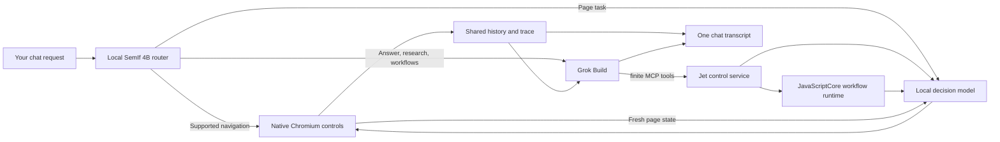

# Jet Browser

A standalone macOS (Apple silicon) Chromium browser with **one local-first agent chat**.
A local SemIf/Qwen 4B router handles simple browser requests on-device; Grok Build takes
over for conversation, research and planning, and configures or writes JavaScript
workflows that local models then run: observing pages, clicking, filling forms, tagging
and summarizing. Both paths share one transcript and one history.

> **Status: alpha.** Built and verified on one maintainer machine. The packaged app is
> Developer ID-signed but not notarized yet, and one build input (the CEF browser engine)
> is still private. See [Current limits](#current-limits).

## What it does

- **Browse with local models.** Navigation, tabs, search and form filling are chosen by
  local models from observed page elements. Models never write page JavaScript or selectors.
- **Long background jobs.** For example: "Organize my first 100 X bookmarks with
  overlapping tags, a summary, the link and the date; review every ten." Grok configures
  a vetted `tagged_feed` workflow, local models do the per-item work in a sandboxed
  JavaScriptCore process, and Grok reviews checkpoints and repairs records. A real
  100-bookmark run completed with 100 unique records
  ([evidence](docs/evidence/real-top100-20260928.json)).
- **Self-contained app.** End users install nothing. CPython and every package, the local
  engines, the Grok CLI and CEF are bundled; model weights and Grok sign-in come from the
  in-app setup screen. The script engine is macOS's own JavaScriptCore.
- **Private by default.** Page content and collected items stay local; Grok sees bounded
  review samples only with your permission. Traces hold counts and identifiers, never page
  text, credentials or model reasoning.

## How it works



- `app/`: Flutter/shadcn shell, chat pane and native CEF host.
- `backend/jet_browser/`: authenticated loopback service, Grok ACP client, workflow runtime
  and store, collections, tracing.
- `backend/jev_ultrafast/`, `vendor/local-engines/`: local decision engines (SemIf, LFM
  RLCD, Laya) and the typing helper.
- `native/`: the launcher and the JavaScriptCore workflow helper.
- `vendor/flutter_cef_browser`, `vendor/vten_chat`, `vendor/shadcn_flutter`: git submodules
  pinned by commit SHA.

Read [architecture](docs/architecture.md), [the workflow contract](docs/portable-workflows.md)
and [the Grok ACP contract](docs/grok-acp.md) for details.

## Build from source

Requirements: Apple silicon Mac with macOS 14+, Xcode command-line tools, Flutter 3.41+,
CocoaPods, [`uv`](https://docs.astral.sh/uv/) and `gh`.

```sh
git clone --recurse-submodules https://github.com/SebRincon/jet-browser.git
cd jet-browser
uv sync --project backend --frozen
./scripts/build_workflow_runtime.sh
backend/.venv/bin/python -m pytest backend/tests -q     # no network or paid calls
cd app && flutter pub get && flutter analyze && flutter test
```

A native app build also needs:

1. **CEF assets**: `scripts/install_cef.sh` installs the pinned CEF build and verifies it by
   hash. That build is private for now (see [Current limits](#current-limits)); without
   it, everything except the native browser builds and tests.
2. **Local engines**: `bash scripts/setup_models.sh` builds four isolated Python
   environments from hash-locked requirements.
3. **Package**: `bash scripts/prepare_portable_runtime.sh`, then
   `python3 scripts/package_runtime.py` (it runs `grok update` and bundles the latest Grok).
   Sign with `scripts/sign_release.sh`.

The full guide, including isolated real-browser tests and diagnostics, is
[docs/development.md](docs/development.md). Contributors and coding agents: start with
[AGENTS.md](AGENTS.md) and [docs/HANDOFF.md](docs/HANDOFF.md).

## Dependencies

All third-party code, binaries and models are listed with repository, pinned commit or
revision, and license in [docs/dependencies/THIRD_PARTY.md](docs/dependencies/THIRD_PARTY.md):

- Flutter packages are submodules pinned by SHA.
- Python code is vendored or installed from pinned commits.
- Engine and service packages are hash-locked.
- Model files are pinned by revision and SHA-256.
- Grok is deliberately not pinned (latest release).

## Current limits

- **CEF engine build is private.** It was built with proprietary codecs (H.264, AAC, HEVC),
  so it is not published until a public CEF build is chosen.
- **Not notarized.** macOS Gatekeeper blocks the app on other machines until it is
  notarized. A clean-account test and a license review of bundled packages are pending.
- **Browser coverage is partial.** Generic form completion still needs manual
  verification. Link selection is first-match. Cross-origin frames, complex editors and
  long runs on hidden tabs are not yet verified.
- **Tag accuracy.** Local tagging misses some tags (synthetic held-out micro F1 about 0.8);
  Grok's checkpoint reviews repair most of the rest.

What was actually verified, including failures, is recorded in
[docs/VERIFICATION.md](docs/VERIFICATION.md). The backlog is in
[tasks/remaining-work.md](tasks/remaining-work.md).

## License

Apache License 2.0; see [LICENSE](LICENSE) and [NOTICE](NOTICE). Third-party components
keep their own licenses.
