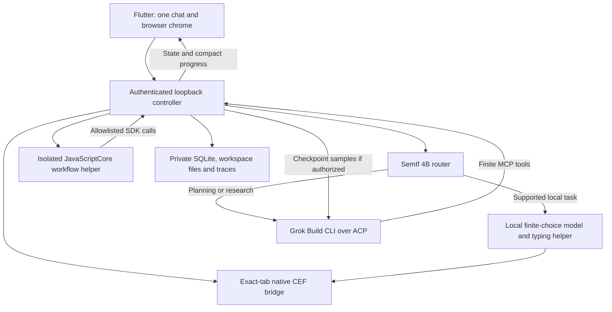

# Architecture and ownership

Jet separates UI, orchestration, native browser control and inference so repeated
browser work can stay local while a larger model plans and reviews it.

## Code map

| Area | Files and responsibility |
| --- | --- |
| App shell | `app/lib/main.dart`, `shell_chrome.dart`, `browser_host.dart`: lifecycle, tabs and state |
| Chat | `agent_pane.dart`, `chat_projection.dart`, `vendor/vten_chat`: one transcript/composer, compact tools |
| Job/artifact views | `workflow_view.dart`, `collection_view.dart`, `workspace_view.dart`, `tab_agent_*`: records, ownership and progress |
| Native transport | `app/lib/native_bridge.dart`, `backend/jet_browser/bridge.py`, `vendor/flutter_cef_browser`: observed-tab commands and acknowledgements |
| Controller | `backend/jet_browser/service.py`: authenticated routes, session/task ownership and integration |
| Routing/inference | `routing.py`, `tasks.py`, `text_runtime.py`, `backend/jev_ultrafast`, `vendor/local-engines`: local decisions and typed values |
| Main provider | `grok.py`, `mcp.py`, `conversation.py`: ACP lifecycle, permission identities and bounded shared history |
| Custom workflows | `workflow_tools.py`, `workflow_store.py`, `workflow_manager.py`, `workflow_capabilities.py`, `workflow_supervisor.py`: revisions, execution, evidence and review |
| Native JS | `native/JetWorkflow/main.swift`, `workflow_runtime.py`: isolated interpreter and bounded RPC |
| Fixed collections | `collection_*`, `feed_collection.py`, `feed_review.py`, `supervisor_agent.py`, `post_recovery.py`: existing plan-based site/feed jobs |
| Storage/diagnostics | `sessions.py`, `workspace.py`, `tracing.py`: durable history, private files and redacted event metadata |
| Distribution | `native/JetLauncher/main.swift`, `runtime_setup.py`, `scripts/package_runtime.py`, `model-downloads.json` |

Python filenames without a prefix in this table are under `backend/jet_browser`;
Flutter view filenames are under `app/lib`. Fixed collections and custom scripted
workflows coexist with separate stores; do not assume their IDs are interchangeable.

## A scripted task, end to end

1. Chat enters the local router. Direct supported navigation stays local; a
   collection request hands off with current browser context and bounded history.
2. Grok inspects the source and SDK, saves a workflow definition and source revision,
   then starts it. Definitions bind tab, URL/source kind, local model, capabilities,
   taxonomy and cumulative limits. Authoring is a remote call and can time out.
3. The native helper runs synchronous JS using only `jet.input` and `jet.call`.
   It has no DOM, Node, network or filesystem globals. The parent validates every
   capability against scope, cancellation, fresh observations and budgets.
4. The script observes/recovers posts, calls local classify/summarize/decide, stores
   records, scrolls and checkpoints. A checkpoint resumes through a fresh invocation
   with saved state; it is not an unbounded recursive process.
5. A review pauses local execution. If sample sharing is enabled, Grok sees at most
   five 400-character excerpts. It can patch conclusions or revise the same source,
   but cannot invent evidence or expand original authority. Unresolved issues escalate.
6. UI cards report live counts/status; users can pause/stop, inspect source/records
   and export artifacts. A different active tab does not retarget the owned job.
   Restart preserves data and marks interrupted work paused/stopped without replay.

SDK limits and exact tool names are in [portable workflows](portable-workflows.md).
The full control plane lives in `service.py`; [SPEC](SPEC.md) describes its baseline
API and later feature docs describe extensions.

## Dependencies and source provenance

| Dependency | Local source/pin | Contract |
| --- | --- | --- |
| Flutter/Dart | App pubspec + lock; verified with Flutter 3.41.6 | macOS arm64 shell; native engine owns accessibility lifecycle |
| shadcn_flutter | `vendor/shadcn_flutter`, 0.0.47, extraction revision `8dc009e44cb915525243a07f7c6e705c0261f9ea` | Independent vten fork; retain BSD license and extraction manifest |
| vten chat | `vendor/vten_chat`, source revision `cc497919140469d58c71849f44210e35c3206766` | Presentation port, constructor-based host boundary; upstream license placeholder is retained |
| CEF plugin | `vendor/flutter_cef_browser`, source `a14b590260a0ed334a7a089db0f733f5818bc0c9` | Native sibling views; exact CEF 147.0.11 / Chromium 147.0.7727.138 assets required |
| Grok Build | Latest release, bundled at build time and updated in Jet's own Grok home at runtime (floor 1.0.41; verified live with 1.0.44); `native/RuntimeLicenses/sources.json` | ACP stdio plus scoped MCP; sign-in in Jet's setup |
| Controller | `backend/pyproject.toml`, `backend/uv.lock`; bundled CPython 3.12.13 | aiohttp/httpx and local OpenTelemetry; no remote telemetry exporter |
| Local engines | `vendor/local-engines/` (hash-locked in `locks/`), laya-mlx and mlx-lm pinned to git commits; see [third-party](dependencies/THIRD_PARTY.md) | LFM RLCD 350M, Laya 421M, typed Laya 421M, SemIf/Qwen 4B |
| Weight downloads | `model-downloads.json` | Pinned snapshots, sizes, SHA256; includes separate Qwen 0.8B typing helper |
| Markdown | `markdown_widget` 2.3.2+8, app lockfile | Rendered content only; no execution |

The vten.ai source (private) and the maintainer's original oui
experiments are reference sources only. No runtime imports or filesystem links
should point back into them. See [extraction hashes](extracted-source.json),
[shadcn details](shadcn-fork.md) and each submodule's `PROVENANCE.md`. No project-wide
redistribution license is inferred from these third-party licenses.
