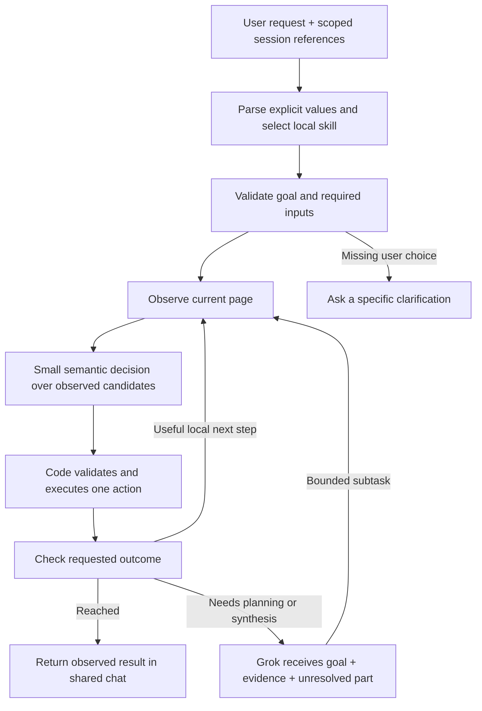

# Local-first agent browser audit

Update, 2026-09-28: the navigation increment now implements known-site homepages without inference, typed search/URL goals and YouTube video/channel/playlist/results completion checks. The findings below retain the original audit context; see [navigation goals](navigation-goals.md) and [current verification](VERIFICATION.md) for subsequent changes. Generic forms, >15-tab selection, extraction, GitHub resource workflows and held-out calibration remain open.

Date: 2026-09-24. Target: standalone Jet Browser. Source vten remains unchanged. This is a code audit, a review of all **18 cookbooks** in the current official Jev documentation index, and fresh local inference/navigation probes. It is not a rerun of all cookbook datasets or a general browser benchmark. Source URLs and retrieved-content hashes are in `artifacts/jev-source-audit.json`.

## Recommendation

Make the local path a library of small browser workflows with explicit completion conditions. A local model selects a workflow and resolves a few semantic choices; code owns transitions, identity checks, budgets and execution. Grok handles an unclear plan, missing reasoning, or synthesis, then returns bounded work to the local executor. An exact navigation should not require a Grok review on every run.

This is consistent with TypeSafe's [architecture guide](https://docs.typesafe.ai/concepts/how-to-build-with-system-one): narrow typed judgments embedded in ordinary software, with independent judgments composed by code. It is an architectural recommendation for Jet, not a claim that these workflows all exist today.

The immediate optimization is better questions and better state, before fine-tuning. Our live failures included an oversized choice set, distracting current-page context in an intent question, and a semantic verifier asked to reason about whether its own answer constituted proof. Changing the task boundary matters as much as the model size.

## What the app actually does today

- `routing.py`: SemIf/Qwen 4B chooses one of 12 operations. Search planning separately extracts a query with the local Qwen 0.8B helper, selects a provider, and determines destination versus results. Its native probabilities are recorded; there is no empirically calibrated accept/escalate policy. Named homepages do not yet have a separate no-query path.
- `conversation.py`: direct browser controls and URL navigation execute in code. Search has a bounded observe/check/follow loop, with original-request checks and at most three follow-up navigations. Observed links are partitioned to respect the native choice limit. Exact supported evidence and model assessments are recorded separately.
- `policy_profiles.py`: the page-action controller already decomposes controls, prunes satisfied actions, and uses tournaments of six candidates. Chunking is already present here; it was missing from the newer search-completion path.
- `tasks.py`: general tasks run the selected LFM/SemIf/Laya model with a 24-step/90-second budget. DONE is still `manual_check`, not an independently verified form submission.
- The independent native shell, one chat transcript, persistent sessions, private traces, Stop fences and finite MCP tools are in place. Grok can delegate local work through that same conversation.

The project has a hosted Jev option, but **SemIf, LFM RLCD and Laya are separate local models, not a locally installed Jev checkpoint**. Hosted Jev's parallelism, context capacity and published quality do not establish those properties for these adapters. The [Jev model reference](https://docs.typesafe.ai/models) describes its served model and versioned API; our installed engines are pinned separately in `vendor/local-engines/runtime.py` and `native_worker.py`.

## Fresh measurements and their limits

`artifacts/local-first-routing-audit.json` contains 24 new diagnostic prompts run through each of four real local engines. This tests **handler selection only**: no preparation, browser action or task completion. Loading was measured separately; the table's latency is the median warm routing call, including any extra disposition check.

| Engine | Agreement on 21 current-handler probes | Warm routing median | Wrongly chose local on a Grok-needed probe |
|---|---:|---:|---:|
| SemIf / Qwen 4B | 20/21 | 127.5 ms | 0 |
| LFM RLCD 350M | 8/21 | 47 ms | 0, but sent 13 local candidates to Grok |
| Laya MLX 421M | 17/21 | 9 ms | 4 |
| Laya Typed 421M | 15/21 | 10 ms | 3 |

All 24 original labels/results remain intact. Three are excluded from this interpretation for every engine: ambiguous “Mercury” can reasonably start with local discovery before disambiguation; email extraction and semantic find are desired local capabilities without dedicated workflows yet. Raw 24-label agreements are 20, 9, 18 and 15 respectively. This distinction is documented in `artifacts/local-first-routing-audit-analysis.json`; it is not an accuracy leaderboard or held-out calibration study.

SemIf unnecessarily escalated “Now find Ada Lovelace there” despite a Wikipedia reference. Laya sometimes interpreted recall or counting as a browser action. LFM's broad router strongly favored `explain`. These results support **SemIf as the current intent router**, with the smaller models evaluated for narrower execution decisions. They do not establish which model is best at every browser task.

The six native navigation regression cases and retained failed attempts are documented in `docs/VERIFICATION.md`. Two complete runs now pass all six with zero Grok calls; final warm cases take 820–1,833 ms, with an 11,949 ms cold first turn. Backend tests are 117 passing. The first run passed 4/6. The second fixed explicit results but still rejected the misspelled name and one alias. A focused real-model probe on captured pages selected the correct Elon link at both 6- and 15-candidate batch sizes, with and without history, and recognized the Quantum alias under two state formats. That is development evidence for clearer questions, not general reliability evidence. No paid Jev calls were made for this audit.

## Findings, ordered by impact

| Finding | Code/evidence | Consequence | Recommended change |
|---|---|---|---|
| Known-site homepages still go through query extraction | The existing chat shows “Bring me to youtube” escalating because the helper returned an ungrounded value | A simple homepage request can invoke Grok unnecessarily | Add a small code-owned site/alias registry and a homepage intent; no query is required |
| One operation is not a complete task contract | `LocalRouter.route/prepare`; search plan contains provider/query/outcome, but no desired resource kind or complete constraints | A channel, video and results list can all look like “YouTube search”; a compound request may lose later work | Add typed goal/skill contracts with required slots and explicit stop predicates |
| Completion is strongest only on the search path | `execute_local`; direct URL bypasses `complete_search`; TaskManager retains `manual_check` | A login redirect or generic form DONE can appear finished without the intended outcome | Reuse outcome contracts across navigation, forms and extraction, retaining unknown/blocked outcomes |
| Page-task completion and chat completion use different logic | `predict_staged` versus `complete_search` | Improvements in one path do not repair the other | Centralize the outcome result contract; keep task-specific checkers |
| Most exceptions immediately escalate | `run_turn` catches local failure and starts Grok | Infrastructure failures and transient observations pay reasoning latency even when no reasoning can help | Typed failure reasons: reobserve, unsupported control, missing user input, uncertain semantics, unavailable engine, unknown mutation outcome |
| Semantics are not calibrated | `choose` records distributions; SemIf confidence is null | A concentrated distribution can still be confidently wrong; one threshold copied from Jev would mislead | Calibrate each model × skill × decision on labeled data; retain null when no confidence is provided |
| History is mostly recent user strings | `run_turn` supplies three requests, not structured completed entities/proposals | “there,” “that one,” and “continue” are brittle or need Grok | Retain completed entity/site/tab/document references, unfinished goal and constraints with provenance |
| Candidate/context limits differ across paths | Search cap/batching versus six-way page-action tournaments; tabs use the shared bounded selector (2026-09-28) | Links still take the first non-NONE batch; tab sets of any size now stay within SemIf's 16-option limit | Shared capability limits and bounded candidate selectors, always retaining an escape and truncation evidence |
| No production coverage measurement | Current fixtures and one-off native runs | “Most requests local” is not measurable yet | Record whole-goal success, local coverage at fixed error rate, unnecessary escalation, latency and recovery cost |

These are application gaps, not evidence that a smaller model merely needs a longer prompt. TypeSafe's own [known limitations](https://docs.typesafe.ai/model-jaggedness/jev-1.13) highlight indirect instructions, irrelevant state, arithmetic and date comparisons. Jet should resolve arithmetic and structural invariants in code and reserve model calls for semantic choices.

## Proposed control flow



A proposed goal record should contain: request identity, selected skill, target site/entity/resource kind, user-supplied slots and their source spans, constraints, expected final state, active tab/document binding, progress evidence, and an action/time budget. It is a code-owned typed record; the model chooses enum values or observed IDs. There is no need to ask a tiny model to generate an arbitrary JSON plan, selector or script.

A skill defines its prerequisites, finite decisions, permitted actions, completion checker and escape conditions. Separate those from the user's goal so changing a workflow cannot silently replace what the user asked for. Missing values stay missing. An unsupported request remains available to Grok intact.

For simple established workflows, no generative planning is necessary. For a novel compound task, Grok can produce an ordered list of registered skills; code validates the plan, and the local controller runs it. Do not split sentences mechanically on “and”: constraints, proper names, negations and dependent clauses are not independent tasks.

## Concrete workflow catalog

These are proposed capabilities and checker contracts, not all implemented features.

| User request / skill | Local work | Completion evidence | When Grok is useful |
|---|---|---|---|
| Go to YouTube / Wikipedia / GitHub home | Select known site + homepage intent; use code-owned site URL | Correct home-page host/type | An unsupported or ambiguous site name |
| Open an explicit site/URL | Parse exact supplied URL; navigate | Actual landed URL/domain and usable page; explain redirects | Destination meaning or redirect is unclear |
| Open a named Wikipedia article | Provider/query; select observed result; resolve alias | Article type + requested entity/topic; results/disambiguation are intermediate | Unresolved ambiguity or unsupported page |
| Show search results | Select provider/query; remain on results | Provider endpoint + actual query + results state | Usually unnecessary |
| Open a YouTube video | Search; choose observed video matching title/channel | Watch-page kind, video identity/title and requested channel | Ambiguous candidates or open-ended recommendation |
| Open a YouTube channel/playlist | Select requested resource type then candidate | Channel/playlist page and entity, not a video with similar words | Missing identity or conflicting matches |
| Open newest video from a channel | Reach channel, extract observed dates, sort in code | Correct channel and observed ordering/date; then watch page | Dates/order absent or a judgment such as “best” lacks criteria |
| Open GitHub repository/release/docs | Select repo identity then section | Exact owner/repo plus requested section/resource | Interpretation of code or release tradeoffs |
| Back, forward, switch/list tabs | Select observed tab; code action | Actual active tab/history result | Ambiguous references only |
| Fill a form using supplied values | Match fields, copy values, select observed options | Every required visible value; stop before submit if asked | Missing input or unusual control |
| Search/filter a catalog or flights | Set fields/options; evaluate each requested filter | Actual filter state and visible results | Inventing preferences, comparing tradeoffs, unsupported widget |
| Find a paragraph | Candidate sections, rank with an explicit no-match outcome | Exact source span and location | Multi-document interpretation |
| Extract email, price, date, table cells | Parse candidates; choose role; normalize in code | Exact spans/row IDs and source; arithmetic validated in code | Missing/conflicting values or free-form interpretation |
| Compare/summarize/research | Local navigation, evidence selection, citation checks | Source-backed answer requirements fulfilled | Grok writes the synthesis; it need not perform every click |
| Continue an unfinished flow | Resolve saved goal and current identity; reobserve | Remaining predicates, not replay of earlier actions | Goal changed or history insufficient |

### Example: “Go to YouTube and open NASA's channel”

The local router selects `navigate_resource`, site YouTube, resource kind channel, entity NASA. The workflow gets search results, filters candidates to channel links, selects among the observed candidates, opens that exact href and checks the landed resource kind/entity. It cannot finish on `/results` or on a video whose title mentions NASA. If the user asks to summarize the newest video, navigation becomes a subtask; Grok gets the relevant evidence for synthesis when that stage is reached.

### Example: “Fill this form and stop before submitting”

The contract contains field/value pairs with source spans and an explicit pre-submit stopping point. Code copies exact user values when possible; local classification binds them to observed controls. After each action, read the affected value. Success requires all requested fields and unchanged submit state. The model's DONE label alone is insufficient. The known prefilled-form native-input issue remains a separate blocker to claiming this workflow reliable.

## All 18 official cookbooks mapped to Jet

The links below describe upstream examples. None of their published benchmark numbers are used as Jet's results.

| Cookbook | Useful adaptation here | Priority |
|---|---|---|
| [Self-consistency: nouls](https://docs.typesafe.ai/cookbooks/consistency_noul_cookbook) | Repeat difficult checks; inspect probability variation and abstention | Evaluation |
| [Self-consistency: choices](https://docs.typesafe.ai/cookbooks/consistency_choice_cookbook) | Test routing stability under paraphrases and candidate order changes | Evaluation |
| [Parallel questions](https://docs.typesafe.ai/cookbooks/parallel_questions) | Batch independent intent/resource-type questions over the same state | High, benchmark local backend first |
| [Re-ranking](https://docs.typesafe.ai/cookbooks/rerank_typesafe) | Cheap retrieval followed by semantic candidate selection | High |
| [Line-by-line search](https://docs.typesafe.ai/cookbooks/semantic_find) | Semantic find-in-page with source spans and no-answer detection | High |
| [Structure recovery](https://docs.typesafe.ai/cookbooks/autoformat) | Preserve text while labeling blocks for reader mode/chat citations | Later |
| [Function calling](https://docs.typesafe.ai/cookbooks/function_calling) | Registered browser skills and finite arguments, with absent-slot handling | High |
| [Skill suggestion](https://docs.typesafe.ai/cookbooks/skill_suggestion) | Select a small workflow shortlist, then inspect detailed prerequisites | High |
| [Entity alignment](https://docs.typesafe.ai/cookbooks/entity_alignment) | Match alias/topic/channel identity while preserving related-but-different | High |
| [Classifying RAG passages](https://docs.typesafe.ai/cookbooks/classifying_rag_passages) | Send relevant evidence and conflicts separately to Grok | High |
| [Citation checks](https://docs.typesafe.ai/cookbooks/citation_check) | Exact quote presence in code, semantic support check locally | High for research |
| [LLM guardrails](https://docs.typesafe.ai/cookbooks/llm_guardrails) | Optional evidence-screening signals; never substitute for code permissions | Supporting |
| [Extraction cascade](https://docs.typesafe.ai/cookbooks/sde_cascade) | Check each extracted field; escalate only unresolved fields | High |
| [Date extraction](https://docs.typesafe.ai/cookbooks/date_extraction_cookbook) | Read date roles/components; timezone/calendar calculation in code | Medium |
| [Pre-parsed extraction](https://docs.typesafe.ai/cookbooks/pre_parsed_value_extraction_cookbook) | Select from observed emails/prices; copy exact spans | High |
| [Hierarchical classification](https://docs.typesafe.ai/cookbooks/hierarchical_classification) | Site → resource kind → skill/candidate; preserve more than one branch when needed | High |
| [Autoresearch features](https://docs.typesafe.ai/cookbooks/autoresearch_feature_discovery) | Offline question tuning with train/validation/test separation | Later, after a labeled corpus |
| [Confidence classification](https://docs.typesafe.ai/cookbooks/classification_using_confidence) | Back off to a broader safe decision when a precise choice is unreliable | Evaluation |

The most direct implementation patterns are [intent routing](https://docs.typesafe.ai/patterns/intent-routing), [speculative fan-out](https://docs.typesafe.ai/patterns/fan-out), and [composite scoring](https://docs.typesafe.ai/patterns/composite-scoring). For Jet, independent semantic checks may be batched, but browser mutations remain sequential. No speculative click or form submission follows from speculative inference.

[Browser Use's Jev Ultrafast](https://github.com/browser-use/jev-ultrafast) supplies our action-space lineage: observed controls, operation/target decisions, separate text helper, guarded execution. Its README explicitly requires independent outcome verification and limits its performance claims to the measured runs. [jkudish/jev-browser](https://github.com/jkudish/jev-browser) is another relevant reference for a code-owned loop with goal/stuck checks and budgets. These are design references; no additional package was installed or benchmark claims imported.

## How to gain speed without losing the goal

1. **Skip unnecessary inference.** Explicit URL parsing, exact user values, singleton targets, date comparisons and tab listing are code work.
2. **Keep the router warm.** The audit's isolated SemIf load took 6.3 seconds; its warm routing median was 128 ms. Separate cold startup from per-request latency.
3. **Use task-specific context.** Intent selection gets the current request and only relevant references. Candidate selection gets useful labels/snippets. Verification gets the requested endpoint plus actual page evidence. A generic DOM dump is not useful for all three.
4. **Batch independent questions when measured to help.** SemIf has a shared-prefix path, but “one request” does not automatically mean one forward pass. Compare wall time, prepare time, forward calls and peak memory against the sequential version.
5. **Chunk with an escape.** Respect the actual engine limits, retain NONE/unknown, preserve candidates outside the first chunk, and record truncation. Never compare normalized probabilities from different candidate batches as if they shared one distribution.
6. **Cache observations and deterministic extraction carefully.** Key semantic decisions by model/prompt revision, complete relevant state, session and document identity. Invalidate on changed input/goal/page. Replaying an answer must not replay a mutation.
7. **Escalate with useful evidence.** Give Grok the original goal, fulfilled predicates, observed page/candidates, failed checks and one unresolved question. A short repair should return control to the local workflow.

Do not route every turn through both a tiny classifier and the 4B classifier until evidence shows that the first stage safely avoids enough second-stage calls to pay for itself. Laya's speed is attractive, but the audit found inappropriate local actions under broad routing. Start with scoped micro-decisions, then measure promotion criteria.

## Verification and escalation policy

The checker should report `reached`, `continue`, `need_observation`, `need_user_input`, `need_reasoning`, `unsupported`, or `unknown_after_action`, plus evidence. These statuses describe different next steps. A native timeout is not a semantic puzzle, and a missing destination cannot be solved by guessing.

Use deterministic evidence when available. Keep semantic acceptance explicitly identified as a model assessment, particularly when the same family routed, selected and checked the task. It is not an independent guarantee. Do not label a model opinion “verified” merely because its probability is large.

TypeSafe's [confidence documentation](https://docs.typesafe.ai/confidence) distinguishes the selected option's probability from a statistic describing the distribution. Our local adapters do not automatically inherit Jev's calibration, and SemIf currently returns null confidence. Tune abstention on held-out cases per skill/model, retaining raw finite distributions for analysis. Do not invent a confidence value or copy documentation thresholds into production.

Authorization remains a code/application decision under the user's request. A model may identify a potential action but cannot grant new permission. Page content is evidence, not instructions. Existing Stop, tab/document checks and no automatic mutation retry remain mandatory; additional model checks supplement those controls rather than replacing them.

## Benchmark plan and acceptance

Build a labeled corpus around the workflow catalog, not just generic classification datasets. Start with at least 10 examples per family across 12 families (120 cases), with paraphrases, negatives, missing information and compound requests. Keep entities/sites/templates separated across development and test partitions. Retain the current 24 probes as development data from now on; tuning against them makes them unsuitable as untouched test evidence.

Use three levels:

- **Decision replay:** frozen page observations, candidate lists and user/history state. Compare whole-state, focused-state, batching and chunking. Include choice limit, long page, Unicode names, negation, duplicate labels, offscreen target, no-match and candidate-order permutations.
- **Owned interactive fixtures:** video/channel/results layouts, repository/release pages, multi-step forms, stale DOM and injected failures. An independent checker reads the actual final state. Exercise Stop during model load, read, queued action and in-flight input.
- **Live native smoke:** Wikipedia, YouTube and GitHub cases in an isolated session/tab. Repeat cold and warm conditions and retain redirects, consent pages, login walls and failures. Do not silently exclude unsuccessful runs or compare warmed and cold engines as throughput rankings.

Report: whole-goal success; false completion; inappropriate mutation; local-only success; unnecessary Grok escalation; p50/p95 end-to-end and model-only latency; cold load; model/helper/native call counts; source/engine/prompt versions; token/context use; cost and recovery latency. Report uncertainty intervals before claiming a coverage rate. A classifier label alone never counts as a completed task.

A proposed promotion gate is zero wrong irreversible actions and zero false-completion regressions on the owned acceptance suite, then a clearly stated held-out success rate with uncertainty and live failures disclosed. These are acceptance requirements, not measured guarantees. There is currently no evidence to promise that a specific percentage of arbitrary requests will run locally.

## Implementation order

1. Finish and retain the navigation regression fixes and actual native results. Keep code guards separate from semantic questions.
2. Introduce the shared goal/outcome contract and capability-aware candidate selector. Fix the >15-tab path with the same bounded selection mechanism. Preserve original compound requirements.
3. Add known-site homepages without a query-helper call, then Wikipedia article/results, YouTube video/channel/playlist, and GitHub repository/release as explicit workflow types with owned fixtures and independent stop checks.
4. Add exact-span extraction and semantic find-in-page. These remove avoidable Grok calls and provide better evidence for tasks that genuinely need Grok.
5. Unify form completion checks and resolve the known prefilled-form native-input failure before expanding form claims.
6. Calibrate routing/recovery on the broader corpus, then test batching, tiny-model first stages and caching as controlled ablations.

The navigation portion of items 2–3 is implemented: typed navigation goals, direct homepages and YouTube resource checks. Shared page-task outcomes, >15-tab selection, GitHub resources and a broader owned fixture corpus remain open, as do items 4–6. The goal is high local coverage at an acceptable whole-task error rate, not minimizing Grok calls regardless of correctness.

## Review and reproduction

The implementation and audit are included in the existing local review run. From this project:

```sh
clankstamp open run_20260924_002021_jet-browser --step step_010
backend/.venv/bin/python scripts/audit_local_routing.py --score artifacts/local-first-routing-audit.json
backend/.venv/bin/python scripts/check_navigation_intent.py --help
```

The native check requires explicit `--run` and an idle running Jet app. It performs the six public Wikipedia tasks in a temporary session/tab and writes a timestamped artifact. The four-model routing diagnostic requires explicit `--run`, operates on synthetic state, and never mutates the browser. No commit, push or publication was performed.
